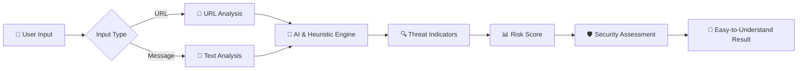
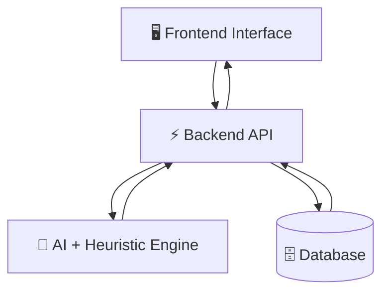

# 🛡️ PhishShield AI

<div align="center">

### **Detect. Analyze. Protect.**

🔗 **AI-Powered Phishing Link & Suspicious Message Analyzer**

[](https://phishshield-ai-1.ai.studio/)
[](#)
[](#)

<br>

> **Don't just click. Analyze first. 🛡️**

</div>

---

## 🌐 Live Demo

🚀 **Experience PhishShield AI:**

👉 **https://phishshield-ai-1.ai.studio**

---

# 🚨 The Problem

Every day, users receive suspicious:

* 🔗 Links
* 📧 Emails
* 💬 Messages
* 🌐 Websites
* 📱 Social engineering attempts

Many phishing attacks use:

* Lookalike domains
* Suspicious URLs
* Urgency-based language
* Fake login pages
* Misleading redirects
* Social engineering techniques

The biggest challenge?

> **Most users don't know whether something is dangerous until it's too late.**

---

# 💡 Our Solution

## 🛡️ PhishShield AI

**PhishShield AI** is an intelligent cybersecurity platform designed to help users identify potentially suspicious links and messages.

Users can submit a suspicious:

```text
🔗 URL
💬 Message
📧 Email Content
```

PhishShield AI analyzes the provided content and presents an **easy-to-understand security assessment**.

Instead of showing complicated technical information, the platform focuses on answering a simple question:

# ❓ Is this suspicious?

---

# ✨ Key Features

## 🔗 URL Risk Analysis

Analyze suspicious URLs for potential warning indicators.

The system can examine factors such as:

* 🌐 Domain structure
* 🔤 Lookalike characters
* 🔢 Unusual URL patterns
* 🔗 Suspicious redirects
* 📏 Excessive URL length
* ⚠️ Risk indicators

---

## 💬 Suspicious Message Analysis

Paste a suspicious message and let the system identify potential phishing patterns.

### Possible indicators include:

* 🚨 Urgent language
* 💰 Financial pressure
* 🔐 Fake security warnings
* 🎁 Too-good-to-be-true offers
* 👤 Impersonation attempts
* 🔗 Suspicious links

---

## 🤖 AI-Powered Analysis

PhishShield AI aims to transform complex cybersecurity signals into simple and understandable results.

Example:

```text
🟢 LOW RISK
The content shows few suspicious indicators.
```

```text
🟡 MEDIUM RISK
Some unusual patterns were detected.
Proceed carefully.
```

```text
🔴 HIGH RISK
Multiple suspicious indicators were detected.
Avoid interacting with unknown links or requests.
```

---

# 📊 Risk Assessment System

PhishShield AI presents results using an intuitive risk system.

| Risk Level           | Meaning                                       |
| -------------------- | --------------------------------------------- |
| 🟢 **Low Risk**      | Few suspicious indicators detected            |
| 🟡 **Medium Risk**   | Some warning signs detected                   |
| 🟠 **High Risk**     | Multiple suspicious patterns detected         |
| 🔴 **Critical Risk** | Strong indicators requiring immediate caution |

---

# 🔍 What Makes PhishShield AI Different?

### ❌ Traditional Security Tools

```text
Complex Reports
Technical Language
Difficult for Beginners
```

### ✅ PhishShield AI

```text
Simple Interface
AI-Assisted Analysis
Easy Risk Scores
Human-Friendly Explanations
```

---

# ⚙️ How It Works



---

# 🧠 Detection Approach

PhishShield AI combines multiple analysis approaches.

## 1️⃣ URL Heuristics

The system can check for unusual patterns such as:

```text
✓ Excessively long URLs
✓ Suspicious domain patterns
✓ Lookalike domains
✓ Unusual characters
✓ Multiple redirects
✓ Unexpected URL structures
```

---

## 2️⃣ Message Heuristics

The system analyzes language for patterns commonly associated with phishing attempts.

Examples include:

```text
⚠️ Urgency
⚠️ Fear-based language
⚠️ Account warnings
⚠️ Fake rewards
⚠️ Requests for sensitive information
```

---

## 3️⃣ AI-Based Understanding

AI helps interpret the context of suspicious messages and convert technical signals into understandable explanations.

---

# 🖥️ User Experience

```text
┌──────────────────────────────────────────────┐
│              🛡️ PHISHSHIELD AI               │
│                                              │
│     Detect. Analyze. Protect.                │
│                                              │
│   ┌────────────────────────────────────┐     │
│   │ Paste Suspicious URL or Message    │     │
│   └────────────────────────────────────┘     │
│                                              │
│            [ 🔍 ANALYZE NOW ]                │
│                                              │
└──────────────────────────────────────────────┘
```

### After Analysis:

```text
╔══════════════════════════════════╗
║        SECURITY ASSESSMENT       ║
╠══════════════════════════════════╣
║                                  ║
║       🔴 HIGH RISK               ║
║                                  ║
║  Risk Score: ████████░░ 82%      ║
║                                  ║
║  ⚠️ Suspicious patterns found    ║
║  ⚠️ Urgency-based language       ║
║  ⚠️ Unusual URL structure        ║
║                                  ║
╚══════════════════════════════════╝
```

---

# 🛠️ Technology Stack

### Frontend

```text
🎨 Modern Web Interface
⚛️ React / Web Technologies
🤖 Google AI Studio
```

### Backend

```text
⚡ API Services
🧠 AI Analysis Engine
🔍 Heuristic Detection Engine
🗄️ Database Integration
```

### Security Layer

```text
🛡️ URL Pattern Analysis
🧠 Message Intelligence
📊 Risk Scoring
🚨 Threat Indicators
```

---

# 🗂️ Project Structure

```text
PhishShield-AI/
│
├── 📁 frontend/
│   ├── components/
│   ├── pages/
│   ├── services/
│   └── assets/
│
├── 📁 backend/
│   ├── api/
│   ├── services/
│   ├── analysis/
│   └── database/
│
├── 📁 docs/
│
├── README.md
└── package.json
```

---

# 🚀 Getting Started

## Clone the Repository

```bash
git clone https://github.com/YOUR-USERNAME/phishshield-ai.git
```

## Navigate to the Project

```bash
cd phishshield-ai
```

## Install Dependencies

```bash
npm install
```

## Run the Project

```bash
npm run dev
```

---

# 🔌 Backend Integration

PhishShield AI is designed with a frontend and backend architecture.



---

# 📡 Example Analysis Flow

### User submits:

```text
Input:
"Your account will be blocked immediately.
Click here to verify your details."
```

### PhishShield AI analyzes:

```text
🔍 Detecting urgency language...
🔍 Checking suspicious patterns...
🔍 Evaluating social engineering indicators...
🔍 Calculating risk score...
```

### Result:

```text
Risk Level: HIGH

Indicators Detected:

⚠️ Urgent language
⚠️ Threat-based messaging
⚠️ Request for immediate action

Recommendation:

🛡️ Verify the source independently before taking action.
```

---

# 🎯 Target Users

PhishShield AI can help:

* 👨‍🎓 Students
* 👩‍💻 Internet Users
* 🏢 Organizations
* 👨‍🏫 Educational Institutions
* 🔐 Cybersecurity Beginners
* 📱 Everyday Smartphone Users

---

# 🌟 Future Enhancements

## 🔮 Roadmap

* [ ] 🌐 Advanced URL reputation checks
* [ ] 🤖 Improved AI threat classification
* [ ] 📧 Email analysis
* [ ] 🖼️ Screenshot-based website analysis
* [ ] 📱 Mobile application
* [ ] 🔔 Real-time security alerts
* [ ] 📊 Personal security dashboard
* [ ] 🌍 Multi-language support
* [ ] 🧩 Browser extension
* [ ] 📈 Advanced analytics

---

# 🛡️ Security Philosophy

> **Technology should make cybersecurity understandable for everyone.**

PhishShield AI focuses on simplifying threat detection so that users can better understand potential warning signs before interacting with suspicious digital content.

---

# 📸 Screenshots

## 🏠 Home Interface

> Add your project screenshot here:

```md

```

## 🔍 Analysis Dashboard

```md

```

---

# 🤝 Contributing

Contributions are welcome!

### Steps:

```text
1. Fork the repository 🍴
        ↓
2. Create a feature branch 🌿
        ↓
3. Make your changes 💻
        ↓
4. Commit your changes ✅
        ↓
5. Create a Pull Request 🚀
```

---

# 📜 License

This project is currently intended for educational, research, and hackathon purposes.

---

# ⚠️ Disclaimer

PhishShield AI provides a **risk assessment based on detected indicators and analysis techniques**.

The results should be treated as an additional security signal and not as an absolute guarantee that a website, message, or link is safe or malicious.

Always use caution when interacting with unknown online content.

---

<div align="center">

# 🛡️ PhishShield AI

### **Detect. Analyze. Protect.**

---

### ⭐ If you like this project, consider giving it a star!

**Built with 💻, 🤖 AI, and a passion for cybersecurity.**

<br>

### 🚀 Making the Internet Safer, One Analysis at a Time.

</div>
